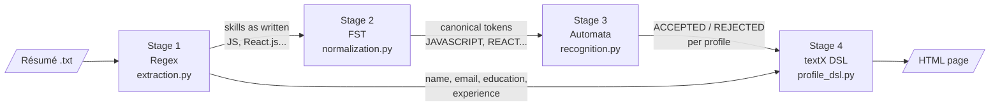

# Architecture and Module Design

ResumeLens works like an assembly line. The résumé text goes in, and each stage passes its result to the next one.

## 1. Pipeline diagram



Only the skills go through the transducers and the automata. Name, email, education and experience go straight from Stage 1 to Stage 4, since there is nothing to normalize in an email address.

`main.py` runs the four stages in this order and prints what each one produced.

## 2. Modules

| File | What it does | Library | Owner |
|---|---|---|---|
| `src/extraction.py` | Stage 1. Finds the candidate data and the skills with regular expressions | `re` | Jhoan |
| `src/profiles.py` | The four profiles from `02-profiles-and-vocabulary.md` written as Python dictionaries | none | Pablo |
| `src/normalization.py` | Stage 2. Transducers that turn each skill into its canonical token, plus the sorting per profile | `pyformlang` | Pablo |
| `src/recognition.py` | Stage 3. One automaton per profile | `pyformlang` | Pablo |
| `src/profile_dsl.py` and `src/resumelens.tx` | Stage 4. Grammar of the candidate profile, validation and HTML output | `textX` | Jhoan |
| `main.py` | Console program: reads a résumé file and runs the four stages | none | Edwin |

## 3. Functions (inputs and outputs)

### extraction.py

| Function | Receives | Returns |
|---|---|---|
| `extract(text)` | the résumé as a string | a dictionary with `name`, `email`, `phone`, `education` (list), `experience` (list) and `skills` (list of strings as written in the résumé) |

Inside the file there is one regex per type of information, as Stage 1 requires, the same way we did in Follow-up 1.

### normalization.py

| Function | Receives | Returns |
|---|---|---|
| `normalize(skills)` | list of skills as written, e.g. `["JS", "React.js"]` | list of canonical tokens without repeats, e.g. `["JAVASCRIPT", "REACT"]`. Skills no transducer recognizes are left out and printed as a warning |
| `sort_for_profile(tokens, profile)` | list of tokens and a profile name | the tokens of that profile only, in the profile's order |

The transducers are built with `add_transition` and used with `translate`, like in Follow-up 3.

### recognition.py

| Function | Receives | Returns |
|---|---|---|
| `classify(tokens)` | list of canonical tokens | a dictionary with the four profiles and `"ACCEPTED"` or `"REJECTED"` for each one |

For each profile it calls `sort_for_profile` and passes the result to that profile's automaton with `accepts`, like in Follow-up 2.

### profile_dsl.py

| Function | Receives | Returns |
|---|---|---|
| `to_dsl(data, tokens, results)` | the dictionary from Stage 1, the tokens from Stage 2 and the results from Stage 3 | the candidate profile written in our DSL, as a string |
| `validate(dsl_text)` | a string in the DSL | the textX model if the text follows the grammar. If not, textX raises an error and the profile is rejected |
| `to_html(model)` | the textX model | a string with the HTML page |

The metamodel is built from `resumelens.tx` with `metamodel_from_file`, and the text is read with `model_from_str`, like in the textX sessions and Follow-up 4.

## 4. Example: one résumé through the pipeline

Input (from the assignment):

```text
Wednesday Addams
3 years of experience developing web applications.
Technical Skills:
JS, React.js, NodeJS, Postgres, Git.
```

| Stage | Output |
|---|---|
| 1. `extract` | name: `Wednesday Addams`, experience: `3 years`, skills: `JS, React.js, NodeJS, Postgres, Git` |
| 2. `normalize` | `JAVASCRIPT, REACT, NODE_JS, POSTGRESQL, GIT` |
| 3. `classify` | Full Stack Developer: ACCEPTED. Machine Learning Engineer, DevOps Engineer, Data Engineer: REJECTED |
| 4. `to_dsl`, `validate`, `to_html` | candidate profile in the DSL, accepted by the grammar, and an HTML page with the name, the skills and the Full Stack result |

What the automata receive in Stage 3 after sorting:

| Profile | Sequence | Result |
|---|---|---|
| Full Stack Developer | `JAVASCRIPT REACT NODE_JS POSTGRESQL GIT` | ACCEPTED |
| Machine Learning Engineer | `POSTGRESQL GIT` | REJECTED (no Python, no data or ML library) |
| DevOps Engineer | `GIT` | REJECTED |
| Data Engineer | `POSTGRESQL GIT` | REJECTED |

## 5. Folders

```
ResumeLens/
├── main.py
├── src/          the five Python files and the grammar
├── tests/        one test file per stage
├── data/         sample résumés in .txt
├── output/       generated HTML pages
└── docs/
```

## 6. Decisions

1. One file per stage, so each stage can be tested alone by giving it what the previous stage would return.
2. The interface is a console program. It shows the result of every stage, which is what the presentation needs.
3. If something fails the program does not stop: unknown skills are printed as warnings, and a DSL text that breaks the grammar is reported with the textX error.
