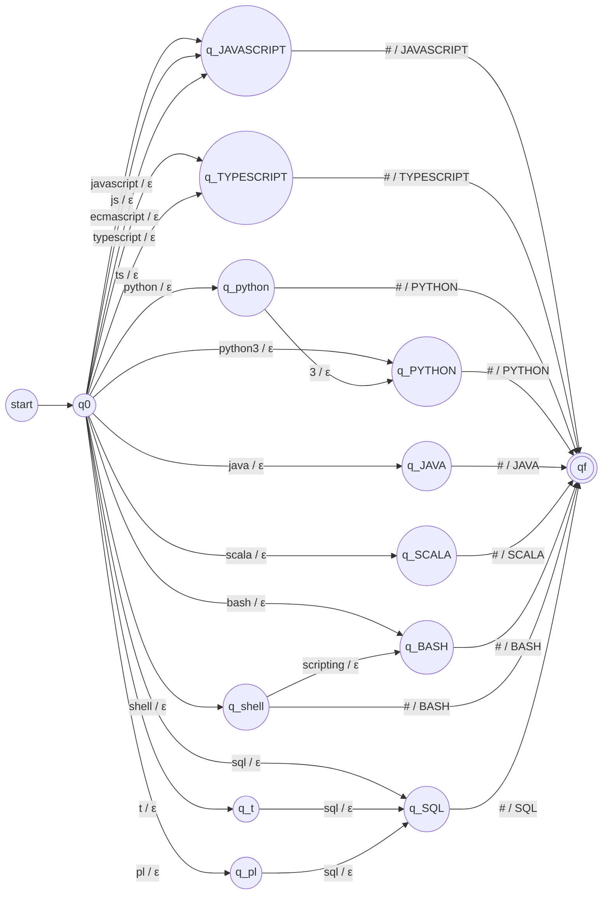
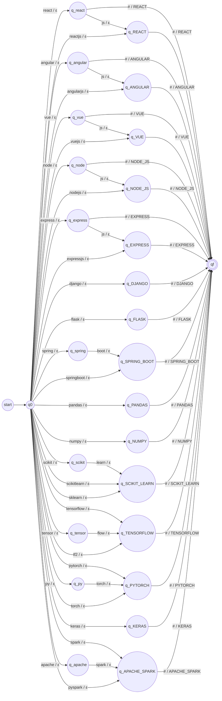
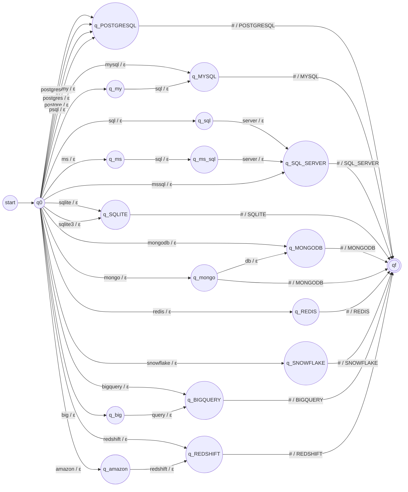
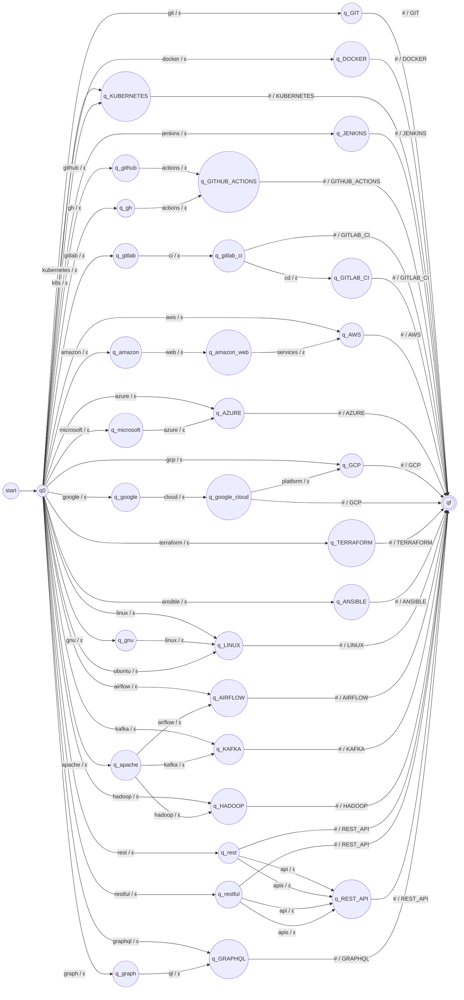
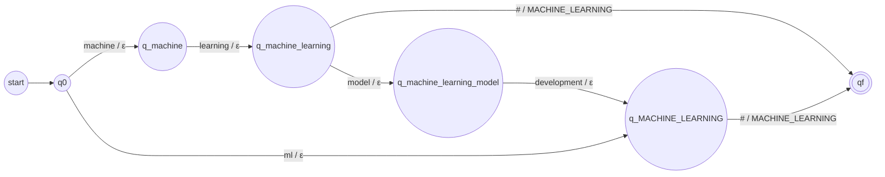

# Stage 2: Normalization with Finite-State Transducers

Stage 1 returns skills exactly as the candidate wrote them: `JS`, `React.js`, `Postgres`. Stage 2 turns each one into its canonical token from `02-profiles-and-vocabulary.md`: `JAVASCRIPT`, `REACT`, `POSTGRESQL`. Then the tokens are sorted once per profile before going to the automata of Stage 3.

## 1. Idea

A transducer reads an input string and writes an output string. Ours read the skill word by word and write nothing until the skill is complete. At the end they write the canonical token. Different spellings of the same skill end in the same state, so they produce the same token. That is the whole normalization.

We use five transducers, one for each category Stage 1 already separates (languages, frameworks and libraries, databases, tools, other). One single transducer would work too, but with about 90 states its diagram would be unreadable. A skill that no transducer accepts is reported as unrecognized.

## 2. Input preparation

Before entering a transducer, the raw string goes through `to_symbols`:

1. Lowercase it, so `NumPy`, `Numpy` and `numpy` are the same input.
2. Split it on spaces, dots, dashes and slashes, so `Scikit-learn` and `Scikit learn` both become `scikit learn`.
3. Add the end mark `#`.

| Raw string | Input symbols |
|---|---|
| `React.js` | `react`, `js`, `#` |
| `ReactJS` | `reactjs`, `#` |
| `Scikit-learn` | `scikit`, `learn`, `#` |
| `GitLab CI/CD` | `gitlab`, `ci`, `cd`, `#` |

So the input symbols are words, not characters, the same way the tiebreak transducer of Follow-up 3 read `A` and `B` as symbols.

The end mark is needed because some variants are the beginning of others. After reading `python` the transducer cannot write `PYTHON` yet, because `python 3` may follow. When `#` arrives, it knows the skill is over.

## 3. Formal definition

All five transducers have the form M = (Q, Σ, Γ, δ, ω, q0, F) with:

- Q: the states. `q0` is the start, `qf` is the only final state. A state named after a token (`q_REACT`) means "a complete variant of this token was read". A state named in lowercase means the words read so far can still go on: either they are not a skill yet (`q_spring` waits for `boot`) or they are a skill but a longer variant exists (`q_react` can end with `#` or read `js`).
- Σ: the words that appear in the variants of that category, plus `#`.
- Γ: the canonical tokens of that category.
- δ: Q × Σ → Q, the transition function. It is partial: if there is no transition, the input is rejected.
- ω: Q × Σ → Γ*, the output function. Every transition writes ε (nothing), except the transitions with `#`, which write the token.
- q0: initial state.
- F = {qf}.

The transducers are deterministic: from each state there is at most one transition per input symbol, so every accepted skill produces exactly one token.

### Example run

T_FW with `React.js`:

| Step | State | Reads | Writes | Goes to |
|---|---|---|---|---|
| 1 | q0 | `react` | ε | q_react |
| 2 | q_react | `js` | ε | q_REACT |
| 3 | q_REACT | `#` | `REACT` | qf |

It ends in qf, which is final, and the output is `REACT`. With `ReactJS` the path is q0, q_REACT, qf, with the same output. With `Reac` there is no transition from q0, so the string is rejected and reported.

### 3.1 T_LANG: Programming languages

| Token | Variants |
|---|---|
| `JAVASCRIPT` | JavaScript, JS, ECMAScript |
| `TYPESCRIPT` | TypeScript, TS |
| `PYTHON` | Python, Python3, Python 3 |
| `JAVA` | Java |
| `SCALA` | Scala |
| `BASH` | Bash, Shell, Shell scripting |
| `SQL` | SQL, T-SQL, PL/SQL |

T_LANG = (Q, Σ, Γ, δ, ω, q0, F) where

- Q = {q0, q_BASH, q_JAVA, q_JAVASCRIPT, q_PYTHON, q_SCALA, q_SQL, q_TYPESCRIPT, q_pl, q_python, q_shell, q_t, qf} (13 states)
- Σ = {3, bash, ecmascript, java, javascript, js, pl, python, python3, scala, scripting, shell, sql, t, ts, typescript, #}
- Γ = {JAVASCRIPT, TYPESCRIPT, PYTHON, JAVA, SCALA, BASH, SQL}
- q0 is the initial state
- F = {qf}
- δ and ω are given by the diagram and the table below

Transition table of T_LANG (27 transitions)

| q | a | δ(q, a) | ω(q, a) |
|---|---|---|---|
| q0 | `javascript` | q_JAVASCRIPT | ε |
| q_JAVASCRIPT | `#` | qf | JAVASCRIPT |
| q0 | `js` | q_JAVASCRIPT | ε |
| q0 | `ecmascript` | q_JAVASCRIPT | ε |
| q0 | `typescript` | q_TYPESCRIPT | ε |
| q_TYPESCRIPT | `#` | qf | TYPESCRIPT |
| q0 | `ts` | q_TYPESCRIPT | ε |
| q0 | `python` | q_python | ε |
| q_python | `#` | qf | PYTHON |
| q0 | `python3` | q_PYTHON | ε |
| q_PYTHON | `#` | qf | PYTHON |
| q_python | `3` | q_PYTHON | ε |
| q0 | `java` | q_JAVA | ε |
| q_JAVA | `#` | qf | JAVA |
| q0 | `scala` | q_SCALA | ε |
| q_SCALA | `#` | qf | SCALA |
| q0 | `bash` | q_BASH | ε |
| q_BASH | `#` | qf | BASH |
| q0 | `shell` | q_shell | ε |
| q_shell | `#` | qf | BASH |
| q_shell | `scripting` | q_BASH | ε |
| q0 | `sql` | q_SQL | ε |
| q_SQL | `#` | qf | SQL |
| q0 | `t` | q_t | ε |
| q_t | `sql` | q_SQL | ε |
| q0 | `pl` | q_pl | ε |
| q_pl | `sql` | q_SQL | ε |

### 3.2 T_FW: Frameworks and libraries

| Token | Variants |
|---|---|
| `REACT` | React, React.js, ReactJS, React JS |
| `ANGULAR` | Angular, AngularJS, Angular.js |
| `VUE` | Vue, Vue.js, VueJS |
| `NODE_JS` | Node, NodeJS, Node.js, Node JS |
| `EXPRESS` | Express, Express.js, ExpressJS |
| `DJANGO` | Django |
| `FLASK` | Flask |
| `SPRING_BOOT` | Spring Boot, SpringBoot, Spring-Boot |
| `PANDAS` | Pandas |
| `NUMPY` | NumPy |
| `SCIKIT_LEARN` | Scikit-learn, Scikit learn, Scikitlearn, sklearn |
| `TENSORFLOW` | TensorFlow, Tensor Flow, TF2 |
| `PYTORCH` | PyTorch, Py Torch, Torch |
| `KERAS` | Keras |
| `APACHE_SPARK` | Spark, Apache Spark, PySpark |

T_FW = (Q, Σ, Γ, δ, ω, q0, F) where

- Q = {q0, q_ANGULAR, q_APACHE_SPARK, q_DJANGO, q_EXPRESS, q_FLASK, q_KERAS, q_NODE_JS, q_NUMPY, q_PANDAS, q_PYTORCH, q_REACT, q_SCIKIT_LEARN, q_SPRING_BOOT, q_TENSORFLOW, q_VUE, q_angular, q_apache, q_express, q_node, q_py, q_react, q_scikit, q_spring, q_tensor, q_vue, qf} (27 states)
- Σ = {angular, angularjs, apache, boot, django, express, expressjs, flask, flow, js, keras, learn, node, nodejs, numpy, pandas, py, pyspark, pytorch, react, reactjs, scikit, scikitlearn, sklearn, spark, spring, springboot, tensor, tensorflow, tf2, torch, vue, vuejs, #}
- Γ = {REACT, ANGULAR, VUE, NODE_JS, EXPRESS, DJANGO, FLASK, SPRING_BOOT, PANDAS, NUMPY, SCIKIT_LEARN, TENSORFLOW, PYTORCH, KERAS, APACHE_SPARK}
- q0 is the initial state
- F = {qf}
- δ and ω are given by the diagram and the table below

Transition table of T_FW (59 transitions)

| q | a | δ(q, a) | ω(q, a) |
|---|---|---|---|
| q0 | `react` | q_react | ε |
| q_react | `#` | qf | REACT |
| q_react | `js` | q_REACT | ε |
| q_REACT | `#` | qf | REACT |
| q0 | `reactjs` | q_REACT | ε |
| q0 | `angular` | q_angular | ε |
| q_angular | `#` | qf | ANGULAR |
| q0 | `angularjs` | q_ANGULAR | ε |
| q_ANGULAR | `#` | qf | ANGULAR |
| q_angular | `js` | q_ANGULAR | ε |
| q0 | `vue` | q_vue | ε |
| q_vue | `#` | qf | VUE |
| q_vue | `js` | q_VUE | ε |
| q_VUE | `#` | qf | VUE |
| q0 | `vuejs` | q_VUE | ε |
| q0 | `node` | q_node | ε |
| q_node | `#` | qf | NODE_JS |
| q0 | `nodejs` | q_NODE_JS | ε |
| q_NODE_JS | `#` | qf | NODE_JS |
| q_node | `js` | q_NODE_JS | ε |
| q0 | `express` | q_express | ε |
| q_express | `#` | qf | EXPRESS |
| q_express | `js` | q_EXPRESS | ε |
| q_EXPRESS | `#` | qf | EXPRESS |
| q0 | `expressjs` | q_EXPRESS | ε |
| q0 | `django` | q_DJANGO | ε |
| q_DJANGO | `#` | qf | DJANGO |
| q0 | `flask` | q_FLASK | ε |
| q_FLASK | `#` | qf | FLASK |
| q0 | `spring` | q_spring | ε |
| q_spring | `boot` | q_SPRING_BOOT | ε |
| q_SPRING_BOOT | `#` | qf | SPRING_BOOT |
| q0 | `springboot` | q_SPRING_BOOT | ε |
| q0 | `pandas` | q_PANDAS | ε |
| q_PANDAS | `#` | qf | PANDAS |
| q0 | `numpy` | q_NUMPY | ε |
| q_NUMPY | `#` | qf | NUMPY |
| q0 | `scikit` | q_scikit | ε |
| q_scikit | `learn` | q_SCIKIT_LEARN | ε |
| q_SCIKIT_LEARN | `#` | qf | SCIKIT_LEARN |
| q0 | `scikitlearn` | q_SCIKIT_LEARN | ε |
| q0 | `sklearn` | q_SCIKIT_LEARN | ε |
| q0 | `tensorflow` | q_TENSORFLOW | ε |
| q_TENSORFLOW | `#` | qf | TENSORFLOW |
| q0 | `tensor` | q_tensor | ε |
| q_tensor | `flow` | q_TENSORFLOW | ε |
| q0 | `tf2` | q_TENSORFLOW | ε |
| q0 | `pytorch` | q_PYTORCH | ε |
| q_PYTORCH | `#` | qf | PYTORCH |
| q0 | `py` | q_py | ε |
| q_py | `torch` | q_PYTORCH | ε |
| q0 | `torch` | q_PYTORCH | ε |
| q0 | `keras` | q_KERAS | ε |
| q_KERAS | `#` | qf | KERAS |
| q0 | `spark` | q_APACHE_SPARK | ε |
| q_APACHE_SPARK | `#` | qf | APACHE_SPARK |
| q0 | `apache` | q_apache | ε |
| q_apache | `spark` | q_APACHE_SPARK | ε |
| q0 | `pyspark` | q_APACHE_SPARK | ε |

### 3.3 T_DB: Databases

| Token | Variants |
|---|---|
| `POSTGRESQL` | PostgreSQL, Postgres, Postgre, PSQL |
| `MYSQL` | MySQL, My SQL |
| `SQL_SERVER` | SQL Server, MS SQL Server, MSSQL |
| `SQLITE` | SQLite, SQLite3 |
| `MONGODB` | MongoDB, Mongo DB, Mongo |
| `REDIS` | Redis |
| `SNOWFLAKE` | Snowflake |
| `BIGQUERY` | BigQuery, Big Query |
| `REDSHIFT` | Redshift, Amazon Redshift |

T_DB = (Q, Σ, Γ, δ, ω, q0, F) where

- Q = {q0, q_BIGQUERY, q_MONGODB, q_MYSQL, q_POSTGRESQL, q_REDIS, q_REDSHIFT, q_SNOWFLAKE, q_SQLITE, q_SQL_SERVER, q_amazon, q_big, q_mongo, q_ms, q_ms_sql, q_my, q_sql, qf} (18 states)
- Σ = {amazon, big, bigquery, db, mongo, mongodb, ms, mssql, my, mysql, postgre, postgres, postgresql, psql, query, redis, redshift, server, snowflake, sql, sqlite, sqlite3, #}
- Γ = {POSTGRESQL, MYSQL, SQL_SERVER, SQLITE, MONGODB, REDIS, SNOWFLAKE, BIGQUERY, REDSHIFT}
- q0 is the initial state
- F = {qf}
- δ and ω are given by the diagram and the table below

Transition table of T_DB (36 transitions)

| q | a | δ(q, a) | ω(q, a) |
|---|---|---|---|
| q0 | `postgresql` | q_POSTGRESQL | ε |
| q_POSTGRESQL | `#` | qf | POSTGRESQL |
| q0 | `postgres` | q_POSTGRESQL | ε |
| q0 | `postgre` | q_POSTGRESQL | ε |
| q0 | `psql` | q_POSTGRESQL | ε |
| q0 | `mysql` | q_MYSQL | ε |
| q_MYSQL | `#` | qf | MYSQL |
| q0 | `my` | q_my | ε |
| q_my | `sql` | q_MYSQL | ε |
| q0 | `sql` | q_sql | ε |
| q_sql | `server` | q_SQL_SERVER | ε |
| q_SQL_SERVER | `#` | qf | SQL_SERVER |
| q0 | `ms` | q_ms | ε |
| q_ms | `sql` | q_ms_sql | ε |
| q_ms_sql | `server` | q_SQL_SERVER | ε |
| q0 | `mssql` | q_SQL_SERVER | ε |
| q0 | `sqlite` | q_SQLITE | ε |
| q_SQLITE | `#` | qf | SQLITE |
| q0 | `sqlite3` | q_SQLITE | ε |
| q0 | `mongodb` | q_MONGODB | ε |
| q_MONGODB | `#` | qf | MONGODB |
| q0 | `mongo` | q_mongo | ε |
| q_mongo | `db` | q_MONGODB | ε |
| q_mongo | `#` | qf | MONGODB |
| q0 | `redis` | q_REDIS | ε |
| q_REDIS | `#` | qf | REDIS |
| q0 | `snowflake` | q_SNOWFLAKE | ε |
| q_SNOWFLAKE | `#` | qf | SNOWFLAKE |
| q0 | `bigquery` | q_BIGQUERY | ε |
| q_BIGQUERY | `#` | qf | BIGQUERY |
| q0 | `big` | q_big | ε |
| q_big | `query` | q_BIGQUERY | ε |
| q0 | `redshift` | q_REDSHIFT | ε |
| q_REDSHIFT | `#` | qf | REDSHIFT |
| q0 | `amazon` | q_amazon | ε |
| q_amazon | `redshift` | q_REDSHIFT | ε |

### 3.4 T_TOOL: Tools and technologies

| Token | Variants |
|---|---|
| `GIT` | Git |
| `DOCKER` | Docker |
| `KUBERNETES` | Kubernetes, K8s |
| `JENKINS` | Jenkins |
| `GITHUB_ACTIONS` | GitHub Actions, GH Actions |
| `GITLAB_CI` | GitLab CI, GitLab CI/CD |
| `AWS` | AWS, Amazon Web Services |
| `AZURE` | Azure, Microsoft Azure |
| `GCP` | GCP, Google Cloud, Google Cloud Platform |
| `TERRAFORM` | Terraform |
| `ANSIBLE` | Ansible |
| `LINUX` | Linux, GNU/Linux, Ubuntu |
| `AIRFLOW` | Airflow, Apache Airflow |
| `KAFKA` | Kafka, Apache Kafka |
| `HADOOP` | Hadoop, Apache Hadoop |
| `REST_API` | REST, RESTful, REST API, REST APIs, RESTful API, RESTful APIs |
| `GRAPHQL` | GraphQL, Graph QL |

T_TOOL = (Q, Σ, Γ, δ, ω, q0, F) where

- Q = {q0, q_AIRFLOW, q_ANSIBLE, q_AWS, q_AZURE, q_DOCKER, q_GCP, q_GIT, q_GITHUB_ACTIONS, q_GITLAB_CI, q_GRAPHQL, q_HADOOP, q_JENKINS, q_KAFKA, q_KUBERNETES, q_LINUX, q_REST_API, q_TERRAFORM, q_amazon, q_amazon_web, q_apache, q_gh, q_github, q_gitlab, q_gitlab_ci, q_gnu, q_google, q_google_cloud, q_graph, q_microsoft, q_rest, q_restful, qf} (33 states)
- Σ = {actions, airflow, amazon, ansible, apache, api, apis, aws, azure, cd, ci, cloud, docker, gcp, gh, git, github, gitlab, gnu, google, graph, graphql, hadoop, jenkins, k8s, kafka, kubernetes, linux, microsoft, platform, ql, rest, restful, services, terraform, ubuntu, web, #}
- Γ = {GIT, DOCKER, KUBERNETES, JENKINS, GITHUB_ACTIONS, GITLAB_CI, AWS, AZURE, GCP, TERRAFORM, ANSIBLE, LINUX, AIRFLOW, KAFKA, HADOOP, REST_API, GRAPHQL}
- q0 is the initial state
- F = {qf}
- δ and ω are given by the diagram and the table below

Transition table of T_TOOL (66 transitions)

| q | a | δ(q, a) | ω(q, a) |
|---|---|---|---|
| q0 | `git` | q_GIT | ε |
| q_GIT | `#` | qf | GIT |
| q0 | `docker` | q_DOCKER | ε |
| q_DOCKER | `#` | qf | DOCKER |
| q0 | `kubernetes` | q_KUBERNETES | ε |
| q_KUBERNETES | `#` | qf | KUBERNETES |
| q0 | `k8s` | q_KUBERNETES | ε |
| q0 | `jenkins` | q_JENKINS | ε |
| q_JENKINS | `#` | qf | JENKINS |
| q0 | `github` | q_github | ε |
| q_github | `actions` | q_GITHUB_ACTIONS | ε |
| q_GITHUB_ACTIONS | `#` | qf | GITHUB_ACTIONS |
| q0 | `gh` | q_gh | ε |
| q_gh | `actions` | q_GITHUB_ACTIONS | ε |
| q0 | `gitlab` | q_gitlab | ε |
| q_gitlab | `ci` | q_gitlab_ci | ε |
| q_gitlab_ci | `#` | qf | GITLAB_CI |
| q_gitlab_ci | `cd` | q_GITLAB_CI | ε |
| q_GITLAB_CI | `#` | qf | GITLAB_CI |
| q0 | `aws` | q_AWS | ε |
| q_AWS | `#` | qf | AWS |
| q0 | `amazon` | q_amazon | ε |
| q_amazon | `web` | q_amazon_web | ε |
| q_amazon_web | `services` | q_AWS | ε |
| q0 | `azure` | q_AZURE | ε |
| q_AZURE | `#` | qf | AZURE |
| q0 | `microsoft` | q_microsoft | ε |
| q_microsoft | `azure` | q_AZURE | ε |
| q0 | `gcp` | q_GCP | ε |
| q_GCP | `#` | qf | GCP |
| q0 | `google` | q_google | ε |
| q_google | `cloud` | q_google_cloud | ε |
| q_google_cloud | `#` | qf | GCP |
| q_google_cloud | `platform` | q_GCP | ε |
| q0 | `terraform` | q_TERRAFORM | ε |
| q_TERRAFORM | `#` | qf | TERRAFORM |
| q0 | `ansible` | q_ANSIBLE | ε |
| q_ANSIBLE | `#` | qf | ANSIBLE |
| q0 | `linux` | q_LINUX | ε |
| q_LINUX | `#` | qf | LINUX |
| q0 | `gnu` | q_gnu | ε |
| q_gnu | `linux` | q_LINUX | ε |
| q0 | `ubuntu` | q_LINUX | ε |
| q0 | `airflow` | q_AIRFLOW | ε |
| q_AIRFLOW | `#` | qf | AIRFLOW |
| q0 | `apache` | q_apache | ε |
| q_apache | `airflow` | q_AIRFLOW | ε |
| q0 | `kafka` | q_KAFKA | ε |
| q_KAFKA | `#` | qf | KAFKA |
| q_apache | `kafka` | q_KAFKA | ε |
| q0 | `hadoop` | q_HADOOP | ε |
| q_HADOOP | `#` | qf | HADOOP |
| q_apache | `hadoop` | q_HADOOP | ε |
| q0 | `rest` | q_rest | ε |
| q_rest | `#` | qf | REST_API |
| q0 | `restful` | q_restful | ε |
| q_restful | `#` | qf | REST_API |
| q_rest | `api` | q_REST_API | ε |
| q_REST_API | `#` | qf | REST_API |
| q_rest | `apis` | q_REST_API | ε |
| q_restful | `api` | q_REST_API | ε |
| q_restful | `apis` | q_REST_API | ε |
| q0 | `graphql` | q_GRAPHQL | ε |
| q_GRAPHQL | `#` | qf | GRAPHQL |
| q0 | `graph` | q_graph | ε |
| q_graph | `ql` | q_GRAPHQL | ε |

### 3.5 T_OTHER: Other qualifications

| Token | Variants |
|---|---|
| `MACHINE_LEARNING` | Machine Learning, Machine-Learning, ML, Machine Learning model development, Machine-learning model development |

T_OTHER = (Q, Σ, Γ, δ, ω, q0, F) where

- Q = {q0, q_MACHINE_LEARNING, q_machine, q_machine_learning, q_machine_learning_model, qf} (6 states)
- Σ = {development, learning, machine, ml, model, #}
- Γ = {MACHINE_LEARNING}
- q0 is the initial state
- F = {qf}
- δ and ω are given by the diagram and the table below

Transition table of T_OTHER (7 transitions)

| q | a | δ(q, a) | ω(q, a) |
|---|---|---|---|
| q0 | `machine` | q_machine | ε |
| q_machine | `learning` | q_machine_learning | ε |
| q_machine_learning | `#` | qf | MACHINE_LEARNING |
| q0 | `ml` | q_MACHINE_LEARNING | ε |
| q_MACHINE_LEARNING | `#` | qf | MACHINE_LEARNING |
| q_machine_learning | `model` | q_machine_learning_model | ε |
| q_machine_learning_model | `development` | q_MACHINE_LEARNING | ε |

## 4. Sorting per profile

The tokens leave Stage 2 in the order the candidate wrote them. The automata need them in a fixed order, so for each profile `sort_for_profile(tokens, profile)` does three things:

1. Keeps only the tokens that appear in that profile's table in `02-profiles-and-vocabulary.md`.
2. Removes repeated tokens. `JS` and `JavaScript` in the same résumé both become `JAVASCRIPT`, and it must count once.
3. Sorts them by their position in the profile table, row by row, and inside a row in the order they are listed.

Example, Full Stack Developer, with the résumé from the assignment written in another order:

| Step | Result |
|---|---|
| Stage 1 | `Git, NodeJS, JS, Postgres, React.js` |
| Stage 2 | `GIT, NODE_JS, JAVASCRIPT, POSTGRESQL, REACT` |
| Keep, remove repeats | same 5 tokens |
| Sort by Full Stack order | `JAVASCRIPT, REACT, NODE_JS, POSTGRESQL, GIT` |

The same 5 tokens sorted for Machine Learning Engineer give `POSTGRESQL, GIT`, since the other three are not in that profile.

Sorting is a plain Python function, not a transducer. The assignment allows it as preparation for Stage 3, and doing it as a transducer would need one state per subset of tokens.

## 5. Implementation notes

- Each transducer is built with pyformlang's `FST`: `add_start_state("q0")`, `add_final_state("qf")` and one `add_transition(state, word, next_state, output)` per row of the tables above, with `[]` as output for ε and `[TOKEN]` for the `#` transitions.
- A skill is normalized with `fst.translate(to_symbols(raw))`, as in Follow-up 3. If the result is empty, the next transducer is tried. If none accepts, the skill goes to the unrecognized list.
- The transitions are generated from the variant tables, so adding a new variant means adding it to the table and to the Stage 1 regex.

## 6. Limitations

- Only listed variants are recognized. `Reactjs` works because of lowercasing, but a typo like `Raect` does not.
- A word with two meanings can only map to one token. `Shell` is mapped to `BASH`, although it could mean another shell.
- `Torch` is mapped to `PYTORCH`. The older Lua library called Torch would be normalized wrong.
