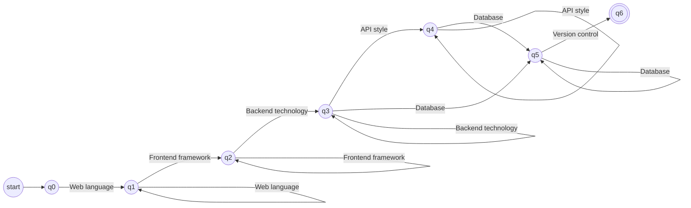
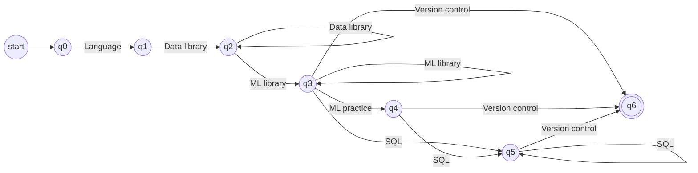
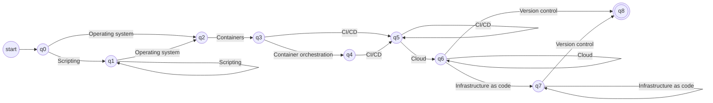
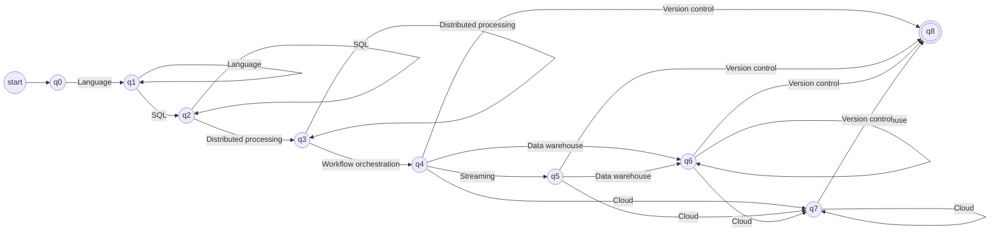

# Stage 3: Profile Recognition with Finite Automata

Stage 3 decides, for each of the four profiles, if the candidate's normalized skills satisfy the profile pattern. Each profile has its own automaton. The input of an automaton is the token sequence produced by `sort_for_profile` (see `05-transducers.md`): only that profile's tokens, without repeats, in the profile order. The output is ACCEPTED or REJECTED.

## 1. From profile table to automaton

Every profile in `02-profiles-and-vocabulary.md` is a list of groups in a fixed order, and each group has a rule: required, at least one, or optional. Because the input is already sorted, the automaton only has to walk through the groups from left to right. We built all four with the same three rules:

1. There is one state per group plus the start: q0, q1, ..., qk. Being in q*i* means "groups 1 to *i* are done".
2. From q*i*, reading a token of group *j* goes to q*j*, as long as every group between them is optional. Skipping an optional group is just jumping over its state. Skipping a required one is impossible, because that transition does not exist.
3. A group with more than one token gets a loop on its own state, so `PANDAS NUMPY` stays in the data library state.

The final states are the ones after which every remaining group is optional. If the last group is required (Git, in our four profiles), the only final state is the last one.

A missing transition means rejection. For example, from q0 of the Full Stack automaton there is no transition with `REACT`, so `REACT GIT` is rejected right away. Pyformlang treats these missing transitions as a jump to a dead state, which is the usual convention for partial transition functions.

## 2. Type of automaton

The four automata are **DFAs**:

- δ is a function Q × Σ → Q: for each state and token there is at most one next state. Groups inside one profile never share a token, so a token always points to a single group.
- There are no ε-transitions. Skipping an optional group is a direct transition, not an empty move.
- There is one initial state.

An NFA would also work: one state per group with ε-transitions over the optional ones. We chose the DFA because the skip transitions are easy to write directly from the table, and because a DFA gives one single path per input, which is simpler to trace in the tests and in the presentation.

## 3. The four automata

### 3.1 Full Stack Developer (`FULL_STACK_DEVELOPER`)

**Pattern.** At least one web language, at least one frontend framework, at least one backend technology, optionally an API style, at least one database and Git.

As a regular expression over tokens:

```
(JAVASCRIPT | TYPESCRIPT)+
(REACT | ANGULAR | VUE)+
(NODE_JS | EXPRESS | DJANGO | FLASK | SPRING_BOOT)+
(REST_API | GRAPHQL)*
(SQL | POSTGRESQL | MYSQL | SQL_SERVER | SQLITE | MONGODB | REDIS)+
GIT
```

M = (Q, Σ, δ, q0, F) where

- Q = {q0, q1, q2, q3, q4, q5, q6}. State q*i* means "groups 1 to *i* are done".
- Σ = {JAVASCRIPT, TYPESCRIPT, REACT, ANGULAR, VUE, NODE_JS, EXPRESS, DJANGO, FLASK, SPRING_BOOT, REST_API, GRAPHQL, SQL, POSTGRESQL, MYSQL, SQL_SERVER, SQLITE, MONGODB, REDIS, GIT} (20 tokens)
- q0 is the initial state
- F = {q6}
- δ: in the diagram each arrow is labeled with a group name and stands for one transition per token of that group. The table lists the tokens.

| From | Reads any of | To |
|---|---|---|
| q0 | JAVASCRIPT, TYPESCRIPT | q1 |
| q1 | REACT, ANGULAR, VUE | q2 |
| q1 | JAVASCRIPT, TYPESCRIPT | q1 |
| q2 | NODE_JS, EXPRESS, DJANGO, FLASK, SPRING_BOOT | q3 |
| q2 | REACT, ANGULAR, VUE | q2 |
| q3 | REST_API, GRAPHQL | q4 |
| q3 | SQL, POSTGRESQL, MYSQL, SQL_SERVER, SQLITE, MONGODB, REDIS | q5 |
| q3 | NODE_JS, EXPRESS, DJANGO, FLASK, SPRING_BOOT | q3 |
| q4 | SQL, POSTGRESQL, MYSQL, SQL_SERVER, SQLITE, MONGODB, REDIS | q5 |
| q4 | REST_API, GRAPHQL | q4 |
| q5 | GIT | q6 |
| q5 | SQL, POSTGRESQL, MYSQL, SQL_SERVER, SQLITE, MONGODB, REDIS | q5 |



| Sorted input | Result |
|---|---|
| `JAVASCRIPT REACT NODE_JS POSTGRESQL GIT` | ACCEPTED |
| `TYPESCRIPT ANGULAR SPRING_BOOT REST_API MYSQL MONGODB GIT` | ACCEPTED |
| `JAVASCRIPT REACT POSTGRESQL GIT` | REJECTED (no backend technology) |

### 3.2 Machine Learning Engineer (`MACHINE_LEARNING_ENGINEER`)

**Pattern.** Python, at least one data library, at least one ML library, optionally the ML practice token and SQL, and Git.

As a regular expression over tokens:

```
PYTHON
(PANDAS | NUMPY)+
(SCIKIT_LEARN | TENSORFLOW | PYTORCH | KERAS)+
MACHINE_LEARNING?
(SQL | POSTGRESQL | MYSQL | SQL_SERVER | SQLITE)*
GIT
```

M = (Q, Σ, δ, q0, F) where

- Q = {q0, q1, q2, q3, q4, q5, q6}. State q*i* means "groups 1 to *i* are done".
- Σ = {PYTHON, PANDAS, NUMPY, SCIKIT_LEARN, TENSORFLOW, PYTORCH, KERAS, MACHINE_LEARNING, SQL, POSTGRESQL, MYSQL, SQL_SERVER, SQLITE, GIT} (14 tokens)
- q0 is the initial state
- F = {q6}
- δ: in the diagram each arrow is labeled with a group name and stands for one transition per token of that group. The table lists the tokens.

| From | Reads any of | To |
|---|---|---|
| q0 | PYTHON | q1 |
| q1 | PANDAS, NUMPY | q2 |
| q2 | SCIKIT_LEARN, TENSORFLOW, PYTORCH, KERAS | q3 |
| q2 | PANDAS, NUMPY | q2 |
| q3 | MACHINE_LEARNING | q4 |
| q3 | SQL, POSTGRESQL, MYSQL, SQL_SERVER, SQLITE | q5 |
| q3 | GIT | q6 |
| q3 | SCIKIT_LEARN, TENSORFLOW, PYTORCH, KERAS | q3 |
| q4 | SQL, POSTGRESQL, MYSQL, SQL_SERVER, SQLITE | q5 |
| q4 | GIT | q6 |
| q5 | GIT | q6 |
| q5 | SQL, POSTGRESQL, MYSQL, SQL_SERVER, SQLITE | q5 |



| Sorted input | Result |
|---|---|
| `PYTHON PANDAS TENSORFLOW POSTGRESQL GIT` | ACCEPTED |
| `PYTHON NUMPY PYTORCH MACHINE_LEARNING GIT` | ACCEPTED |
| `PYTHON PANDAS NUMPY SQL GIT` | REJECTED (no ML library) |

### 3.3 DevOps Engineer (`DEVOPS_ENGINEER`)

**Pattern.** Optionally a scripting language, Linux, Docker, optionally Kubernetes, at least one CI/CD tool, at least one cloud, optionally an infrastructure-as-code tool, and Git.

As a regular expression over tokens:

```
(BASH | PYTHON)*
LINUX
DOCKER
KUBERNETES?
(JENKINS | GITHUB_ACTIONS | GITLAB_CI)+
(AWS | AZURE | GCP)+
(TERRAFORM | ANSIBLE)*
GIT
```

M = (Q, Σ, δ, q0, F) where

- Q = {q0, q1, q2, q3, q4, q5, q6, q7, q8}. State q*i* means "groups 1 to *i* are done".
- Σ = {BASH, PYTHON, LINUX, DOCKER, KUBERNETES, JENKINS, GITHUB_ACTIONS, GITLAB_CI, AWS, AZURE, GCP, TERRAFORM, ANSIBLE, GIT} (14 tokens)
- q0 is the initial state
- F = {q8}
- δ: in the diagram each arrow is labeled with a group name and stands for one transition per token of that group. The table lists the tokens.

| From | Reads any of | To |
|---|---|---|
| q0 | BASH, PYTHON | q1 |
| q0 | LINUX | q2 |
| q1 | LINUX | q2 |
| q1 | BASH, PYTHON | q1 |
| q2 | DOCKER | q3 |
| q3 | KUBERNETES | q4 |
| q3 | JENKINS, GITHUB_ACTIONS, GITLAB_CI | q5 |
| q4 | JENKINS, GITHUB_ACTIONS, GITLAB_CI | q5 |
| q5 | AWS, AZURE, GCP | q6 |
| q5 | JENKINS, GITHUB_ACTIONS, GITLAB_CI | q5 |
| q6 | TERRAFORM, ANSIBLE | q7 |
| q6 | GIT | q8 |
| q6 | AWS, AZURE, GCP | q6 |
| q7 | GIT | q8 |
| q7 | TERRAFORM, ANSIBLE | q7 |



| Sorted input | Result |
|---|---|
| `LINUX DOCKER KUBERNETES JENKINS AWS TERRAFORM GIT` | ACCEPTED |
| `BASH LINUX DOCKER GITHUB_ACTIONS AZURE GIT` | ACCEPTED |
| `LINUX DOCKER KUBERNETES AWS GIT` | REJECTED (no CI/CD tool) |

### 3.4 Data Engineer (`DATA_ENGINEER`)

**Pattern.** At least one language among Python, Scala and Java, at least one SQL token, at least one distributed processing tool, Airflow, optionally Kafka, a warehouse and a cloud, and Git.

As a regular expression over tokens:

```
(PYTHON | SCALA | JAVA)+
(SQL | POSTGRESQL | MYSQL | SQL_SERVER | SQLITE)+
(APACHE_SPARK | HADOOP)+
AIRFLOW
KAFKA?
(SNOWFLAKE | BIGQUERY | REDSHIFT)*
(AWS | AZURE | GCP)*
GIT
```

M = (Q, Σ, δ, q0, F) where

- Q = {q0, q1, q2, q3, q4, q5, q6, q7, q8}. State q*i* means "groups 1 to *i* are done".
- Σ = {PYTHON, SCALA, JAVA, SQL, POSTGRESQL, MYSQL, SQL_SERVER, SQLITE, APACHE_SPARK, HADOOP, AIRFLOW, KAFKA, SNOWFLAKE, BIGQUERY, REDSHIFT, AWS, AZURE, GCP, GIT} (19 tokens)
- q0 is the initial state
- F = {q8}
- δ: in the diagram each arrow is labeled with a group name and stands for one transition per token of that group. The table lists the tokens.

| From | Reads any of | To |
|---|---|---|
| q0 | PYTHON, SCALA, JAVA | q1 |
| q1 | SQL, POSTGRESQL, MYSQL, SQL_SERVER, SQLITE | q2 |
| q1 | PYTHON, SCALA, JAVA | q1 |
| q2 | APACHE_SPARK, HADOOP | q3 |
| q2 | SQL, POSTGRESQL, MYSQL, SQL_SERVER, SQLITE | q2 |
| q3 | AIRFLOW | q4 |
| q3 | APACHE_SPARK, HADOOP | q3 |
| q4 | KAFKA | q5 |
| q4 | SNOWFLAKE, BIGQUERY, REDSHIFT | q6 |
| q4 | AWS, AZURE, GCP | q7 |
| q4 | GIT | q8 |
| q5 | SNOWFLAKE, BIGQUERY, REDSHIFT | q6 |
| q5 | AWS, AZURE, GCP | q7 |
| q5 | GIT | q8 |
| q6 | AWS, AZURE, GCP | q7 |
| q6 | GIT | q8 |
| q6 | SNOWFLAKE, BIGQUERY, REDSHIFT | q6 |
| q7 | GIT | q8 |
| q7 | AWS, AZURE, GCP | q7 |



| Sorted input | Result |
|---|---|
| `PYTHON SQL APACHE_SPARK AIRFLOW KAFKA BIGQUERY GIT` | ACCEPTED |
| `SCALA POSTGRESQL HADOOP AIRFLOW AWS GIT` | ACCEPTED |
| `PYTHON APACHE_SPARK AIRFLOW KAFKA BIGQUERY GIT` | REJECTED (no SQL) |
## 4. Implementation notes

- Each automaton is a pyformlang `DeterministicFiniteAutomaton`, built with `add_start_state`, `add_final_state` and one `add_transition(state, token, next_state)` per token in the δ tables. The tables are generated from the profile groups with the three rules of section 1, so changing a profile in `profiles.py` changes its automaton.
- `classify(tokens)` sorts the tokens for each profile and calls `accepts`, as in Follow-up 2. It returns ACCEPTED or REJECTED for the four profiles.
- `is_deterministic()` returns `True` for the four automata.

## 5. Limitations

- The loops let the same group repeat in any order (`TYPESCRIPT JAVASCRIPT` is accepted). This never happens because the input is sorted and has no repeats, but the language of the automaton is a bit larger than the pattern.
- Patterns only count which skills appear, not years of experience or level.
- A résumé can be accepted by several profiles or by none. That is intended: the result says which patterns are satisfied, not which candidate is better.
